# MinIO 架构图集（Mermaid 可视化）

> 这是整套上手文档的"看图版"：把分散在概览（`01–07`）和精读（`deep/01–29`）里的关键流程与
> 结构用 Mermaid 图画出来。每张图下方标注对应的深读篇，图文对照效果最好。
>
> GitHub / VS Code（装 Mermaid 插件）/ Obsidian 等可直接渲染下面的 Mermaid 代码块（本文件含 32 张图）。

## 目录
**核心（图 1–19）**
- [1. 全局分层架构](#1-全局分层架构)
- [2. 对象定位：三次哈希](#2-对象定位三次哈希)
- [3. 进程启动顺序](#3-进程启动顺序)
- [4. PUT 请求端到端](#4-put-请求端到端)
- [5. GET 请求端到端](#5-get-请求端到端)
- [6. 写入内核：编码与原子提交](#6-写入内核编码与原子提交)
- [7. 读取内核：触发器通道自平衡并行读](#7-读取内核触发器通道自平衡并行读)
- [8. xl.meta 结构](#8-xlmeta-结构)
- [9. 分布式拓扑与 grid](#9-分布式拓扑与-grid)
- [10. 分布式锁 quorum 加锁](#10-分布式锁-quorum-加锁)
- [11. 认证授权流程](#11-认证授权流程)
- [12. 信封加密](#12-信封加密)
- [13. 后台任务全景](#13-后台任务全景)
- [14. 复制与 MRF](#14-复制与-mrf)
- [15. 自愈双线触发](#15-自愈双线触发)
- [16. 生命周期与分层](#16-生命周期与分层)
- [17. 事件通知 store-and-forward](#17-事件通知-store-and-forward)
- [18. S3 Select 流水线](#18-s3-select-流水线)
- [19. 全系统模块地图](#19-全系统模块地图)

**外围与运维（图 20–32）**
- [20. Batch Jobs：检查点续传 + 节点分配](#20-batch-jobs检查点续传--节点分配)
- [21. Site Replication：对等广播 + 两阶段 heal](#21-site-replication对等广播--两阶段-heal)
- [22. Metrics：分组 TTL 缓存 + 依赖门控](#22-metrics分组-ttl-缓存--依赖门控)
- [23. 退役/重平衡：搬运 = 逐对象重写](#23-退役重平衡搬运--逐对象重写)
- [24. S3 Select SQL 引擎：解析 → AST → 树遍历](#24-s3-select-sql-引擎解析--ast--树遍历)
- [25. 多段上传：三段式](#25-多段上传三段式)
- [26. 对象列举与 metacache](#26-对象列举与-metacache)
- [27. bucket 元数据存储与传播](#27-bucket-元数据存储与传播)
- [28. STS AssumeRole 统一流程](#28-sts-assumerole-统一流程)
- [29. 配置子系统：ENV 覆盖 + 加密 + 历史](#29-配置子系统env-覆盖--加密--历史)
- [30. 对象锁 WORM 删除判定](#30-对象锁-worm-删除判定)
- [31. 集群内协调 vs 跨集群复制](#31-集群内协调-vs-跨集群复制)
- [32. Admin Heal：异步可轮询](#32-admin-heal异步可轮询)

---

## 1. 全局分层架构

> 对应 [概览 01](01-overview-architecture.md)。两层接口（ObjectLayer / StorageAPI）吃掉单机与分布式差异。

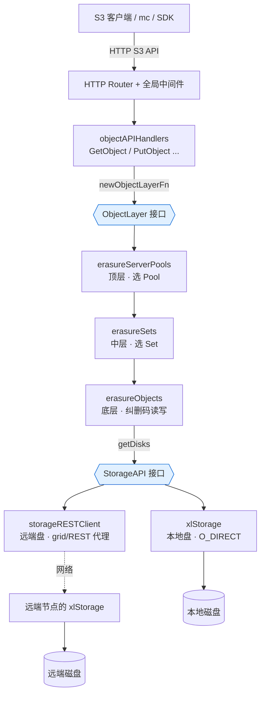
```mermaid
flowchart TD
    Client["S3 客户端 / mc / SDK"] -->|HTTP S3 API| Router["HTTP Router + 全局中间件"]
    Router --> Handlers["objectAPIHandlers<br/>GetObject / PutObject ..."]
    Handlers -->|newObjectLayerFn| OL{{"ObjectLayer 接口"}}

    OL --> ESP["erasureServerPools<br/>顶层 · 选 Pool"]
    ESP --> ES["erasureSets<br/>中层 · 选 Set"]
    ES --> EO["erasureObjects<br/>底层 · 纠删码读写"]
    EO -->|getDisks| SAPI{{"StorageAPI 接口"}}

    SAPI --> Local["xlStorage<br/>本地盘 · O_DIRECT"]
    SAPI --> Remote["storageRESTClient<br/>远端盘 · grid/REST 代理"]
    Remote -.网络.-> RemoteNode["远端节点的 xlStorage"]

    Local --> Disk1[("本地磁盘")]
    RemoteNode --> Disk2[("远端磁盘")]

    style OL fill:#e1f0ff,stroke:#0366d6
    style SAPI fill:#e1f0ff,stroke:#0366d6
```

---

## 2. 对象定位：三次哈希

> 对应 [概览 01](01-overview-architecture.md) + [深读 05](deep/05-pool-set-routing-deep.md)。位置靠算不靠查，无中心元数据。

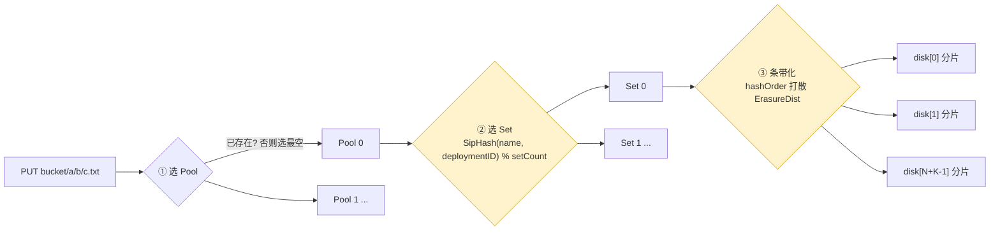
```mermaid
flowchart LR
    Obj["PUT bucket/a/b/c.txt"] --> H1{"① 选 Pool"}
    H1 -->|"已存在? 否则选最空"| P0["Pool 0"]
    H1 --> P1["Pool 1 ..."]
    P0 --> H2{"② 选 Set<br/>SipHash(name, deploymentID) % setCount"}
    H2 --> S0["Set 0"]
    H2 --> S1["Set 1 ..."]
    S0 --> H3{"③ 条带化<br/>hashOrder 打散 ErasureDist"}
    H3 --> D0["disk[0] 分片"]
    H3 --> D1["disk[1] 分片"]
    H3 --> DN["disk[N+K-1] 分片"]
    style H2 fill:#fff3cd,stroke:#d39e00
    style H3 fill:#fff3cd,stroke:#d39e00
```

---

## 3. 进程启动顺序

> 对应 [概览 02 §2.1](02-request-lifecycle.md)。HTTP 先于 ObjectLayer 就绪，waitForQuorum 守住可服务门槛。

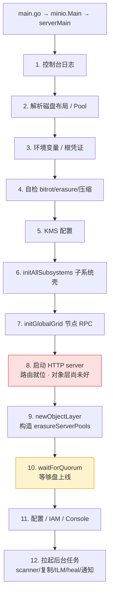
```mermaid
flowchart TD
    M["main.go → minio.Main → serverMain"] --> A["1. 控制台日志"]
    A --> B["2. 解析磁盘布局 / Pool"]
    B --> C["3. 环境变量 / 根凭证"]
    C --> D["4. 自检 bitrot/erasure/压缩"]
    D --> E["5. KMS 配置"]
    E --> F["6. initAllSubsystems 子系统壳"]
    F --> G["7. initGlobalGrid 节点 RPC"]
    G --> H["8. 启动 HTTP server<br/>路由就位 · 对象层尚未好"]
    H --> I["9. newObjectLayer<br/>构造 erasureServerPools"]
    I --> J["10. waitForQuorum<br/>等够盘上线"]
    J --> K["11. 配置 / IAM / Console"]
    K --> L["12. 拉起后台任务<br/>scanner/复制/ILM/heal/通知"]
    style H fill:#ffe0e0,stroke:#d33
    style J fill:#fff3cd,stroke:#d39e00
```

---

## 4. PUT 请求端到端

> 对应 [概览 02 §2.3](02-request-lifecycle.md) + [深读 01](deep/01-write-path-deep.md)。

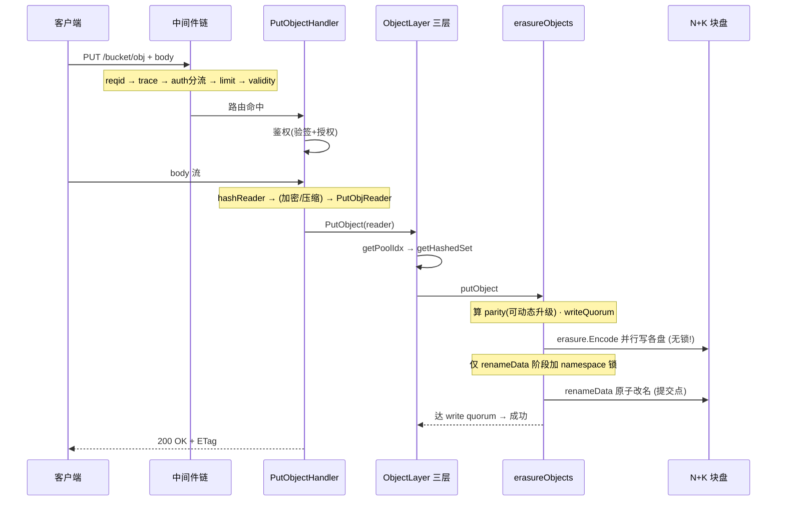
```mermaid
sequenceDiagram
    participant C as 客户端
    participant MW as 中间件链
    participant H as PutObjectHandler
    participant OL as ObjectLayer 三层
    participant EO as erasureObjects
    participant D as N+K 块盘

    C->>MW: PUT /bucket/obj + body
    Note over MW: reqid → trace → auth分流 → limit → validity
    MW->>H: 路由命中
    H->>H: 鉴权(验签+授权)
    C->>H: body 流
    Note over H: hashReader → (加密/压缩) → PutObjReader
    H->>OL: PutObject(reader)
    OL->>OL: getPoolIdx → getHashedSet
    OL->>EO: putObject
    Note over EO: 算 parity(可动态升级) · writeQuorum
    EO->>D: erasure.Encode 并行写各盘 (无锁!)
    Note over EO: 仅 renameData 阶段加 namespace 锁
    EO->>D: renameData 原子改名 (提交点)
    EO-->>OL: 达 write quorum → 成功
    H-->>C: 200 OK + ETag
```

---

## 5. GET 请求端到端

> 对应 [概览 02 §2.4](02-request-lifecycle.md) + [深读 02](deep/02-read-path-deep.md)。

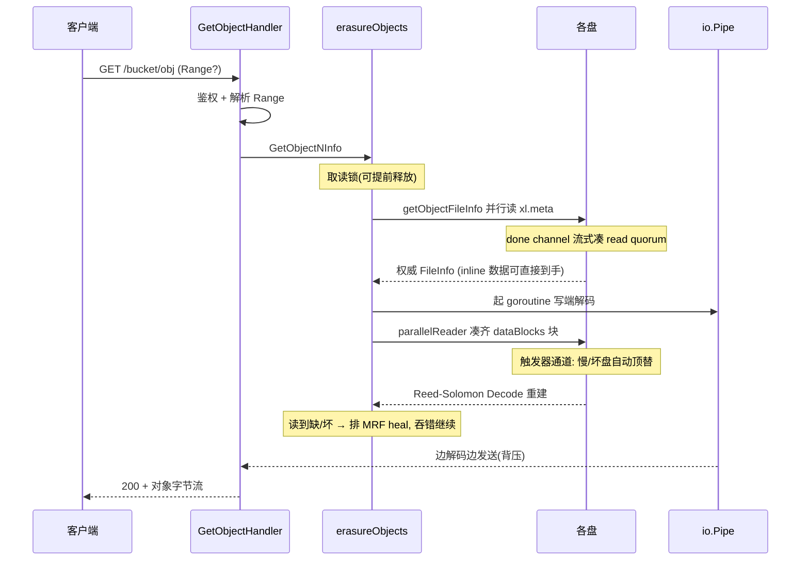
```mermaid
sequenceDiagram
    participant C as 客户端
    participant H as GetObjectHandler
    participant EO as erasureObjects
    participant D as 各盘
    participant P as io.Pipe

    C->>H: GET /bucket/obj (Range?)
    H->>H: 鉴权 + 解析 Range
    H->>EO: GetObjectNInfo
    Note over EO: 取读锁(可提前释放)
    EO->>D: getObjectFileInfo 并行读 xl.meta
    Note over D: done channel 流式凑 read quorum
    D-->>EO: 权威 FileInfo (inline 数据可直接到手)
    EO->>P: 起 goroutine 写端解码
    EO->>D: parallelReader 凑齐 dataBlocks 块
    Note over D: 触发器通道: 慢/坏盘自动顶替
    D-->>EO: Reed-Solomon Decode 重建
    Note over EO: 读到缺/坏 → 排 MRF heal, 吞错继续
    P-->>H: 边解码边发送(背压)
    H-->>C: 200 + 对象字节流
```

---

## 6. 写入内核：编码与原子提交

> 对应 [深读 01](deep/01-write-path-deep.md) + [深读 04](deep/04-xlstorage-disk-deep.md)。

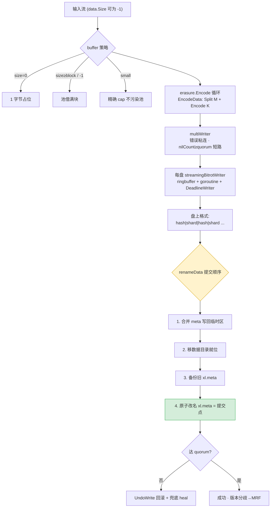
```mermaid
flowchart TD
    In["输入流 (data.Size 可为 -1)"] --> Buf{"buffer 策略"}
    Buf -->|size=0| B0["1 字节占位"]
    Buf -->|"size≥block / -1"| BP["池借满块"]
    Buf -->|small| BS["精确 cap 不污染池"]
    Buf --> Enc["erasure.Encode 循环<br/>EncodeData: Split M + Encode K"]
    Enc --> MW["multiWriter<br/>错误粘连 · nilCount≥quorum 短路"]
    MW --> BW["每盘 streamingBitrotWriter<br/>ringbuffer + goroutine + DeadlineWriter"]
    BW --> Fmt["盘上格式:<br/>hash|shard|hash|shard ..."]
    Fmt --> RD{"renameData 提交顺序"}
    RD --> R1["1. 合并 meta 写回临时区"]
    R1 --> R2["2. 移数据目录就位"]
    R2 --> R3["3. 备份旧 xl.meta"]
    R3 --> R4["4. 原子改名 xl.meta = 提交点"]
    R4 --> Fail{"达 quorum?"}
    Fail -->|否| UW["UndoWrite 回滚 + 兜底 heal"]
    Fail -->|是| OK["成功 · 版本分歧→MRF"]
    style R4 fill:#d4edda,stroke:#28a745
    style RD fill:#fff3cd,stroke:#d39e00
```

---

## 7. 读取内核：触发器通道自平衡并行读

> 对应 [深读 02 §4](deep/02-read-path-deep.md)。"成功投 false、失败投 true"实现只读够 dataBlocks、坏盘无缝顶替。

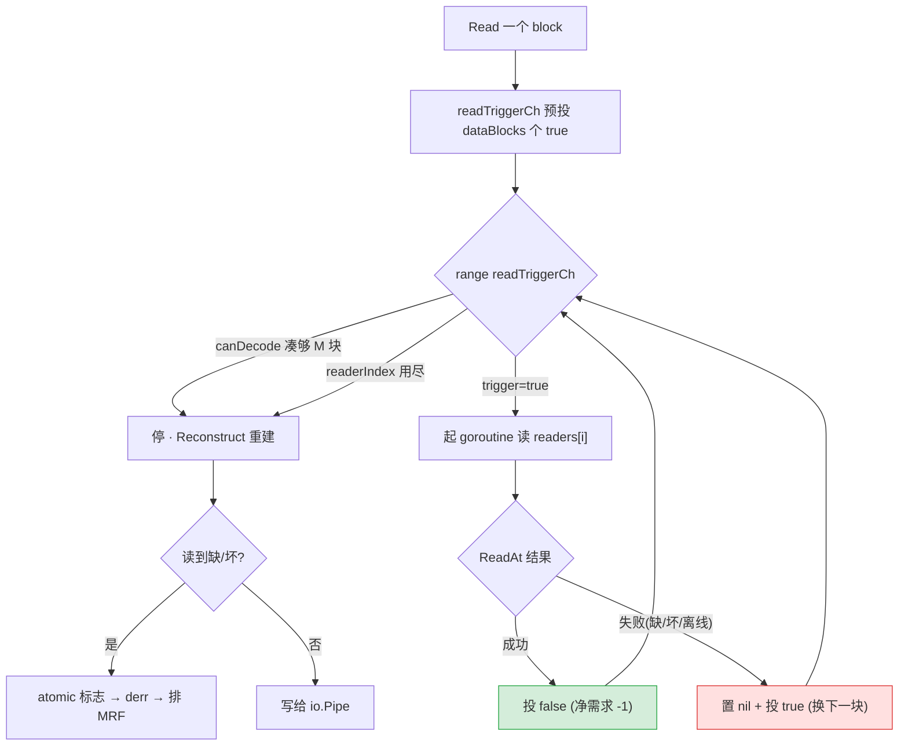
```mermaid
flowchart TD
    Start["Read 一个 block"] --> Seed["readTriggerCh 预投 dataBlocks 个 true"]
    Seed --> Loop{"range readTriggerCh"}
    Loop -->|canDecode 凑够 M 块| Done["停 · Reconstruct 重建"]
    Loop -->|readerIndex 用尽| Done
    Loop -->|"trigger=true"| Go["起 goroutine 读 readers[i]"]
    Go --> RA{"ReadAt 结果"}
    RA -->|成功| F["投 false (净需求 -1)"]
    RA -->|"失败(缺/坏/离线)"| T["置 nil + 投 true (换下一块)"]
    F --> Loop
    T --> Loop
    Done --> Heal{"读到缺/坏?"}
    Heal -->|是| MRF["atomic 标志 → derr → 排 MRF"]
    Heal -->|否| Out["写给 io.Pipe"]
    style F fill:#d4edda,stroke:#28a745
    style T fill:#ffe0e0,stroke:#d33
```

---

## 8. xl.meta 结构

> 对应 [深读 03](deep/03-xlmeta-format-deep.md)。多版本容器 + shallow version 惰性反序列化 + inline。

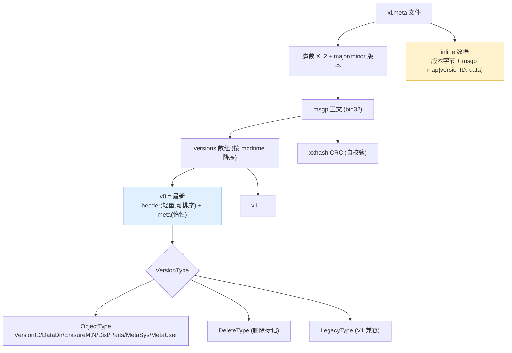
```mermaid
flowchart TD
    File["xl.meta 文件"] --> Hdr["魔数 XL2 + major/minor 版本"]
    Hdr --> Body["msgp 正文 (bin32)"]
    Body --> Vers["versions 数组 (按 modtime 降序)"]
    Vers --> V0["v0 = 最新<br/>header(轻量,可排序) + meta(惰性)"]
    Vers --> V1["v1 ..."]
    V0 --> T{"VersionType"}
    T --> OT["ObjectType<br/>VersionID/DataDir/ErasureM,N/Dist/Parts/MetaSys/MetaUser"]
    T --> DT["DeleteType (删除标记)"]
    T --> LT["LegacyType (V1 兼容)"]
    Body --> CRC["xxhash CRC (自校验)"]
    File --> Inline["inline 数据<br/>版本字节 + msgp map{versionID: data}"]
    style V0 fill:#e1f0ff,stroke:#0366d6
    style Inline fill:#fff3cd,stroke:#d39e00
```

---

## 9. 分布式拓扑与 grid

> 对应 [概览 04](04-distributed-grid-locks.md) + [深读 06](deep/06-grid-rpc-deep.md)。一对节点一条多路复用 WebSocket。

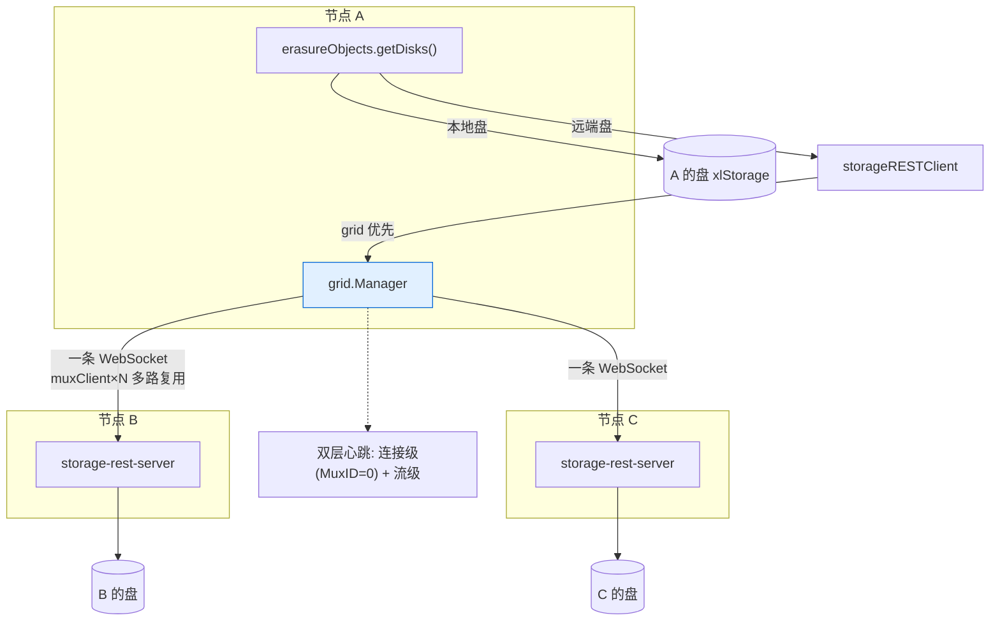
```mermaid
flowchart TB
    subgraph NodeA["节点 A"]
        EOa["erasureObjects.getDisks()"]
        GMa["grid.Manager"]
    end
    subgraph NodeB["节点 B"]
        SRSb["storage-rest-server"]
    end
    subgraph NodeC["节点 C"]
        SRSc["storage-rest-server"]
    end
    EOa -->|本地盘| LocalDisk[("A 的盘 xlStorage")]
    EOa -->|远端盘| RC["storageRESTClient"]
    RC -->|grid 优先| GMa
    GMa -->|"一条 WebSocket<br/>muxClient×N 多路复用"| SRSb
    GMa -->|"一条 WebSocket"| SRSc
    SRSb --> BDisk[("B 的盘")]
    SRSc --> CDisk[("C 的盘")]
    Note["双层心跳: 连接级(MuxID=0) + 流级"]
    GMa -.-> Note
    style GMa fill:#e1f0ff,stroke:#0366d6
```

---

## 10. 分布式锁 quorum 加锁

> 对应 [深读 07](deep/07-dsync-locks-deep.md)。广播 → 收集 → 不足回滚 → 续约。

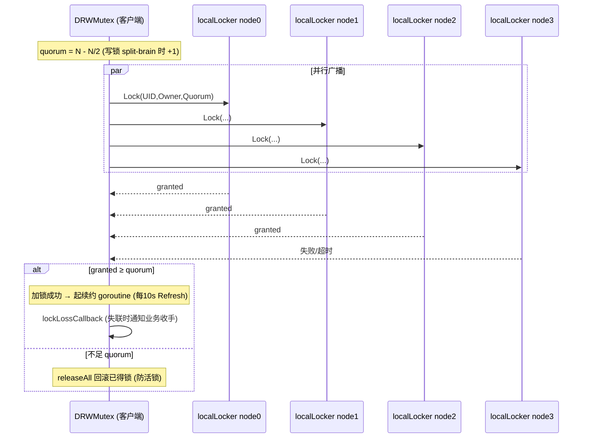
```mermaid
sequenceDiagram
    participant C as DRWMutex (客户端)
    participant N0 as localLocker node0
    participant N1 as localLocker node1
    participant N2 as localLocker node2
    participant N3 as localLocker node3

    Note over C: quorum = N - N/2 (写锁 split-brain 时 +1)
    par 并行广播
        C->>N0: Lock(UID,Owner,Quorum)
        C->>N1: Lock(...)
        C->>N2: Lock(...)
        C->>N3: Lock(...)
    end
    N0-->>C: granted
    N1-->>C: granted
    N2-->>C: granted
    N3-->>C: 失败/超时
    alt granted ≥ quorum
        Note over C: 加锁成功 → 起续约 goroutine (每10s Refresh)
        C->>C: lockLossCallback (失联时通知业务收手)
    else 不足 quorum
        Note over C: releaseAll 回滚已得锁 (防活锁)
    end
```

---

## 11. 认证授权流程

> 对应 [概览 05](05-iam-security.md) + [深读 08](deep/08-signature-v4-deep.md) + [深读 09](deep/09-iam-store-deep.md)。

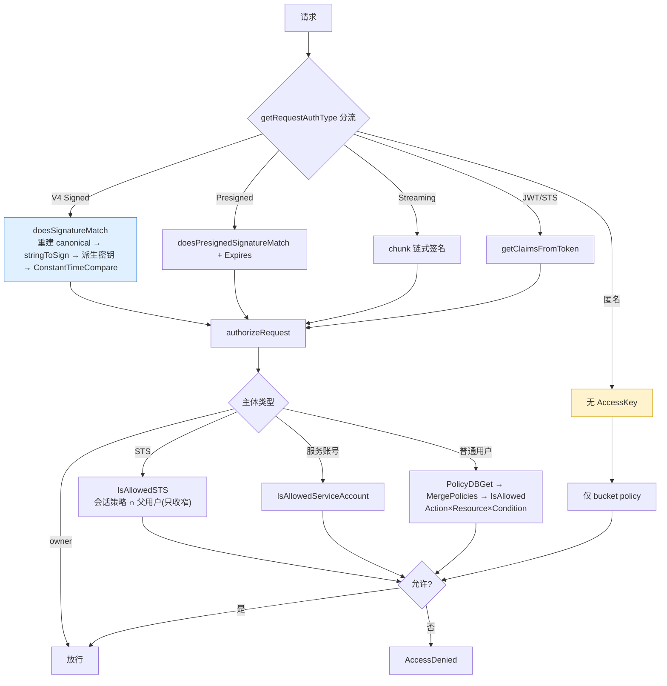
```mermaid
flowchart TD
    Req["请求"] --> Type{"getRequestAuthType 分流"}
    Type -->|V4 Signed| V4["doesSignatureMatch<br/>重建 canonical → stringToSign → 派生密钥 → ConstantTimeCompare"]
    Type -->|Presigned| PS["doesPresignedSignatureMatch + Expires"]
    Type -->|Streaming| ST["chunk 链式签名"]
    Type -->|JWT/STS| JWT["getClaimsFromToken"]
    Type -->|匿名| Anon["无 AccessKey"]
    V4 --> Authz["authorizeRequest"]
    PS --> Authz
    ST --> Authz
    JWT --> Authz
    Anon --> BP["仅 bucket policy"]
    Authz --> Who{"主体类型"}
    Who -->|owner| Allow["放行"]
    Who -->|STS| STS["IsAllowedSTS<br/>会话策略 ∩ 父用户(只收窄)"]
    Who -->|服务账号| SA["IsAllowedServiceAccount"]
    Who -->|普通用户| U["PolicyDBGet → MergePolicies → IsAllowed<br/>Action×Resource×Condition"]
    BP --> Decide{"允许?"}
    STS --> Decide
    SA --> Decide
    U --> Decide
    Decide -->|是| Allow
    Decide -->|否| Deny["AccessDenied"]
    style V4 fill:#e1f0ff,stroke:#0366d6
    style Anon fill:#fff3cd,stroke:#d39e00
```

---

## 12. 信封加密

> 对应 [概览 05](05-iam-security.md) + [深读 10](deep/10-crypto-sse-deep.md)。主密钥只封装对象密钥，不碰大数据。

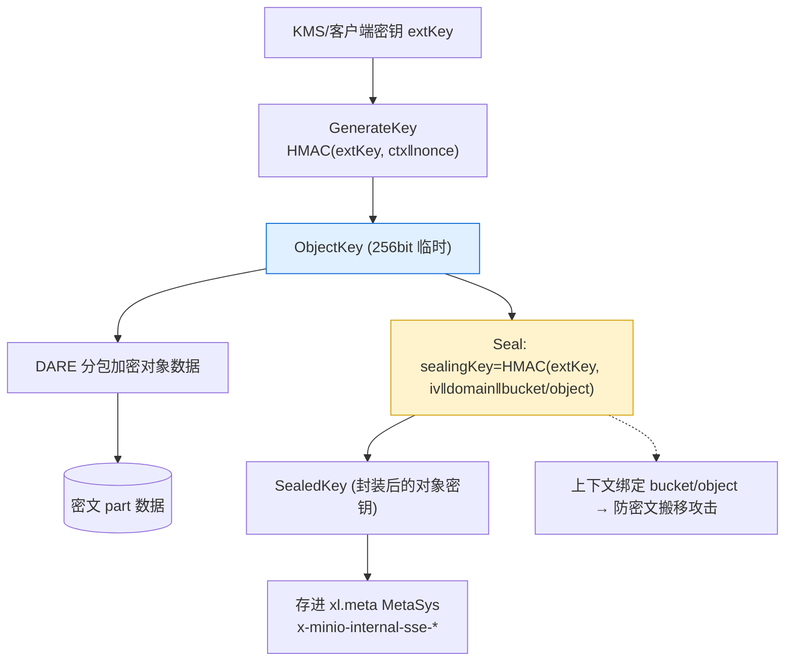
```mermaid
flowchart TD
    KMS["KMS/客户端密钥 extKey"] --> Gen["GenerateKey<br/>HMAC(extKey, ctx‖nonce)"]
    Gen --> OK["ObjectKey (256bit 临时)"]
    OK --> EncData["DARE 分包加密对象数据"]
    EncData --> Cipher[("密文 part 数据")]
    OK --> Seal["Seal: sealingKey=HMAC(extKey, iv‖domain‖bucket/object)"]
    Seal --> Sealed["SealedKey (封装后的对象密钥)"]
    Sealed --> Meta["存进 xl.meta MetaSys<br/>x-minio-internal-sse-*"]
    Note["上下文绑定 bucket/object → 防密文搬移攻击"]
    Seal -.-> Note
    style Seal fill:#fff3cd,stroke:#d39e00
    style OK fill:#e1f0ff,stroke:#0366d6
```

---

## 13. 后台任务全景

> 对应 [概览 06](06-data-services.md)。共用骨架：单 leader + 任务队列 + 磁盘溢出。

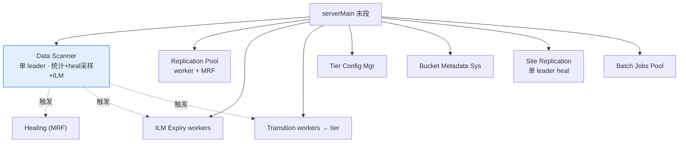
```mermaid
flowchart TD
    SM["serverMain 末段"] --> Scan["Data Scanner<br/>单 leader · 统计+heal采样+ILM"]
    SM --> Repl["Replication Pool<br/>worker + MRF"]
    SM --> Exp["ILM Expiry workers"]
    SM --> Trans["Transition workers → tier"]
    SM --> Tier["Tier Config Mgr"]
    SM --> BMeta["Bucket Metadata Sys"]
    SM --> Site["Site Replication<br/>单 leader heal"]
    SM --> Batch["Batch Jobs Pool"]
    Scan -.触发.-> Heal["Healing (MRF)"]
    Scan -.触发.-> Exp
    Scan -.触发.-> Trans
    style Scan fill:#e1f0ff,stroke:#0366d6
```

---

## 14. 复制与 MRF

> 对应 [深读 11](deep/11-replication-deep.md)。异步多目标 + 非阻塞入队 + 磁盘溢出兜底。

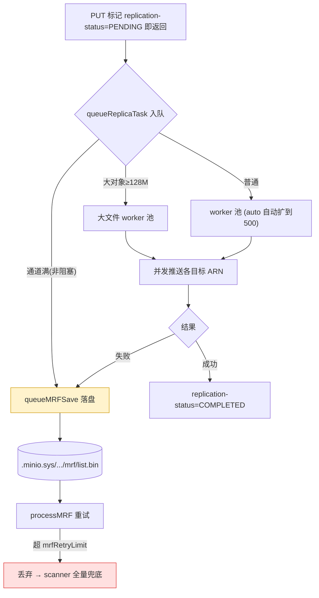
```mermaid
flowchart TD
    Put["PUT 标记 replication-status=PENDING 即返回"] --> Q{"queueReplicaTask 入队"}
    Q -->|大对象≥128M| LW["大文件 worker 池"]
    Q -->|普通| W["worker 池 (auto 自动扩到500)"]
    Q -->|"通道满(非阻塞)"| MRFsave["queueMRFSave 落盘"]
    LW --> Send["并发推送各目标 ARN"]
    W --> Send
    Send --> Status{"结果"}
    Status -->|成功| Done["replication-status=COMPLETED"]
    Status -->|失败| MRFsave
    MRFsave --> Disk[(".minio.sys/.../mrf/list.bin")]
    Disk --> Retry["processMRF 重试"]
    Retry -->|超 mrfRetryLimit| Drop["丢弃 → scanner 全量兜底"]
    style MRFsave fill:#fff3cd,stroke:#d39e00
    style Drop fill:#ffe0e0,stroke:#d33
```

---

## 15. 自愈双线触发

> 对应 [深读 13](deep/13-healing-mrf-deep.md)。MRF 快速精确 + scanner 慢速全量。

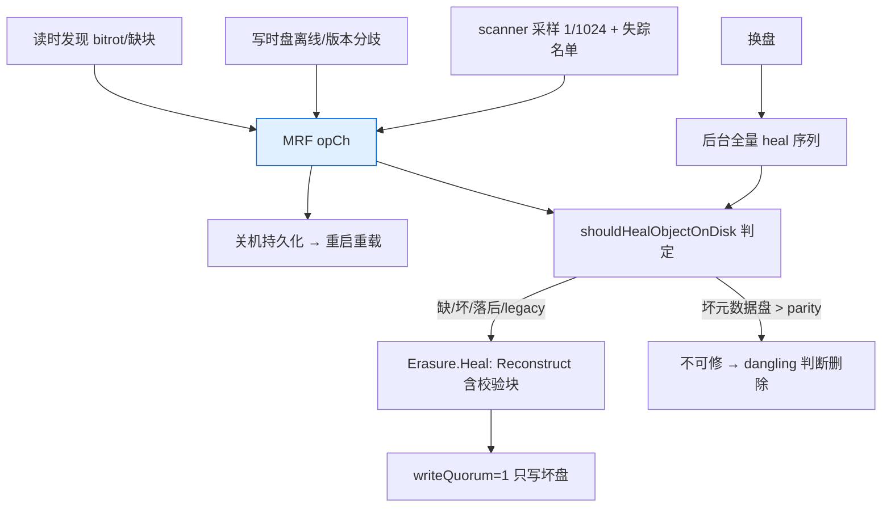
```mermaid
flowchart TD
    R["读时发现 bitrot/缺块"] --> MRF["MRF opCh"]
    Wr["写时盘离线/版本分歧"] --> MRF
    Sc["scanner 采样 1/1024 + 失踪名单"] --> MRF
    Disk["换盘"] --> BG["后台全量 heal 序列"]
    MRF --> Persist["关机持久化 → 重启重载"]
    MRF --> Decide["shouldHealObjectOnDisk 判定"]
    BG --> Decide
    Decide -->|缺/坏/落后/legacy| Reb["Erasure.Heal: Reconstruct 含校验块"]
    Decide -->|"坏元数据盘 > parity"| Dang["不可修 → dangling 判断删除"]
    Reb --> Write["writeQuorum=1 只写坏盘"]
    style MRF fill:#e1f0ff,stroke:#0366d6
```

---

## 16. 生命周期与分层

> 对应 [深读 18](deep/18-lifecycle-ilm-deep.md)。求值搭 scanner 车，转储到 WarmBackend。

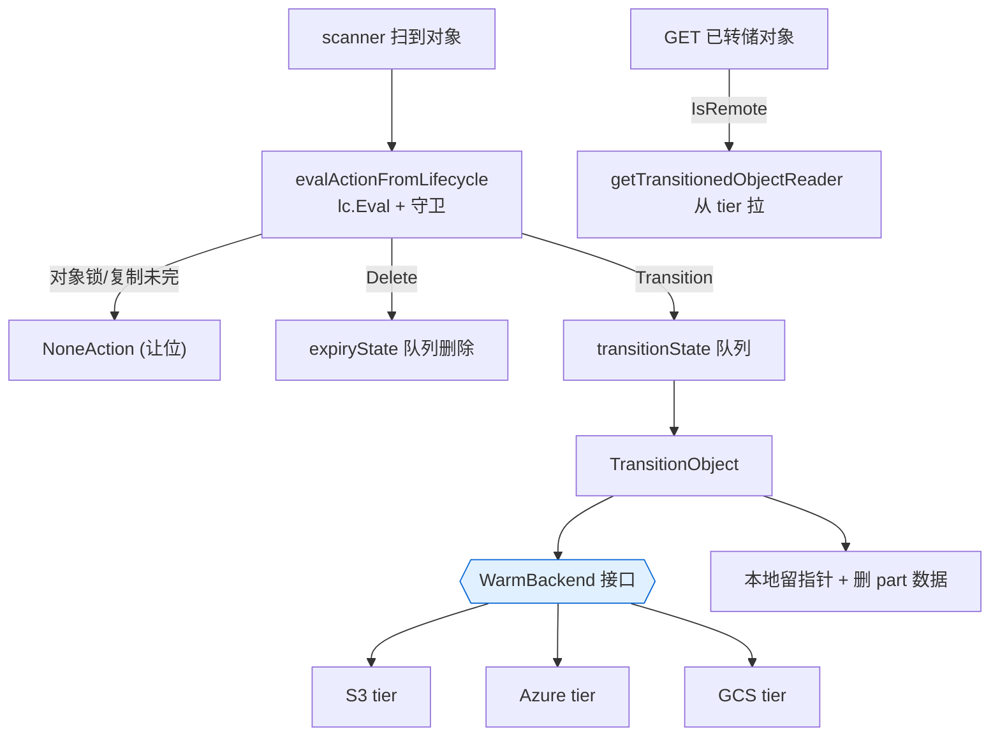
```mermaid
flowchart TD
    Scan["scanner 扫到对象"] --> Eval["evalActionFromLifecycle<br/>lc.Eval + 守卫"]
    Eval -->|对象锁/复制未完| None["NoneAction (让位)"]
    Eval -->|Delete| Exp["expiryState 队列删除"]
    Eval -->|Transition| TQ["transitionState 队列"]
    TQ --> TO["TransitionObject"]
    TO --> WB{{"WarmBackend 接口"}}
    WB --> S3["S3 tier"]
    WB --> AZ["Azure tier"]
    WB --> GCS["GCS tier"]
    TO --> Ptr["本地留指针 + 删 part 数据"]
    Get["GET 已转储对象"] -->|IsRemote| Pull["getTransitionedObjectReader 从 tier 拉"]
    style WB fill:#e1f0ff,stroke:#0366d6
```

---

## 17. 事件通知 store-and-forward

> 对应 [深读 19](deep/19-event-notification-deep.md)。持久化队列 + 回放 + 多层背压。

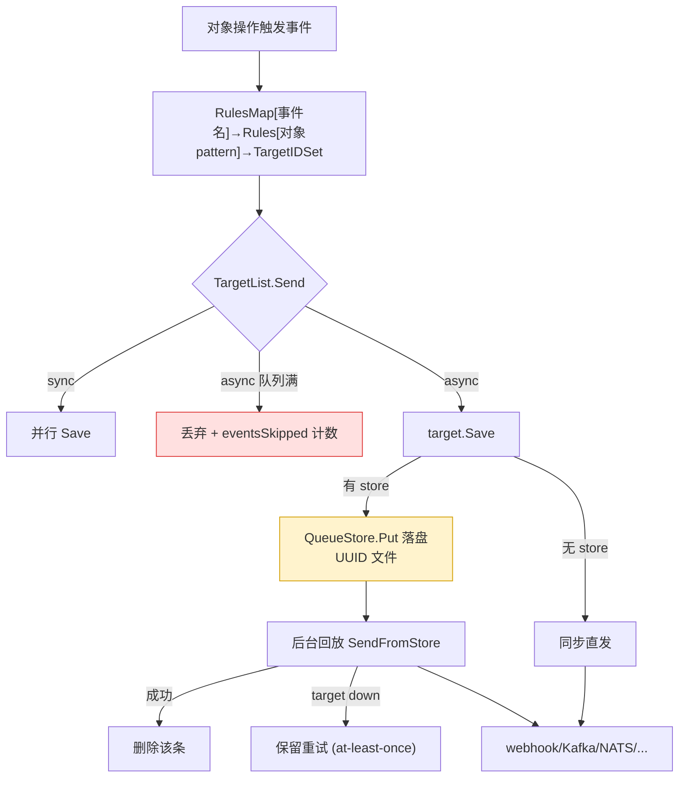
```mermaid
flowchart TD
    Ev["对象操作触发事件"] --> Match["RulesMap[事件名]→Rules[对象pattern]→TargetIDSet"]
    Match --> Send{"TargetList.Send"}
    Send -->|sync| Direct["并行 Save"]
    Send -->|"async 队列满"| Skip["丢弃 + eventsSkipped 计数"]
    Send -->|async| Save["target.Save"]
    Save -->|有 store| QS["QueueStore.Put 落盘<br/>UUID 文件"]
    Save -->|无 store| DSend["同步直发"]
    QS --> Replay["后台回放 SendFromStore"]
    Replay -->|成功| Del["删除该条"]
    Replay -->|"target down"| Keep["保留重试 (at-least-once)"]
    DSend --> Ext["webhook/Kafka/NATS/..."]
    Replay --> Ext
    style QS fill:#fff3cd,stroke:#d39e00
    style Skip fill:#ffe0e0,stroke:#d33
```

---

## 18. S3 Select 流水线

> 对应 [深读 20](deep/20-s3select-deep.md) + [深读 21](deep/21-s3select-sql-engine-deep.md)。

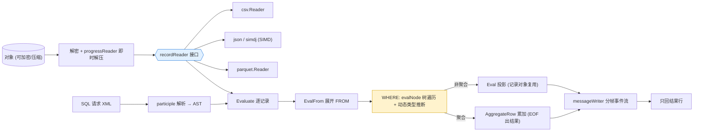
```mermaid
flowchart LR
    SQL["SQL 请求 XML"] --> Parse["participle 解析 → AST"]
    Obj[("对象 (可加密/压缩)")] --> Dec["解密 + progressReader 即时解压"]
    Dec --> RR{{"recordReader 接口"}}
    RR --> CSV["csv.Reader"]
    RR --> JSON["json / simdj (SIMD)"]
    RR --> PQ["parquet.Reader"]
    Parse --> Loop["Evaluate 逐记录"]
    RR --> Loop
    Loop --> EF["EvalFrom 展开 FROM"]
    EF --> WH["WHERE: evalNode 树遍历 + 动态类型推断"]
    WH -->|聚合| Agg["AggregateRow 累加 (EOF 出结果)"]
    WH -->|非聚合| Proj["Eval 投影 (记录对象复用)"]
    Agg --> Out["messageWriter 分帧事件流"]
    Proj --> Out
    Out --> Client["只回结果行"]
    style RR fill:#e1f0ff,stroke:#0366d6
    style WH fill:#fff3cd,stroke:#d39e00
```

---

## 19. 全系统模块地图

> 把所有篇章串成一张图。颜色区分层次。

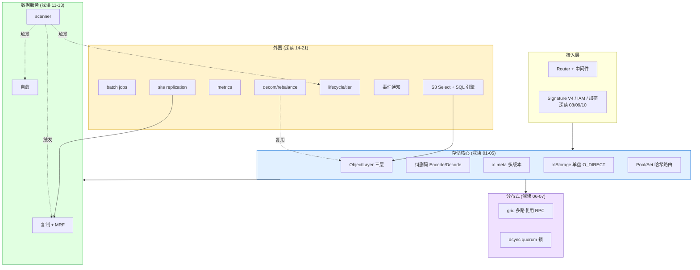
```mermaid
flowchart TB
    subgraph API["接入层"]
        RT["Router + 中间件"]
        AUTH["Signature V4 / IAM / 加密<br/>深读 08/09/10"]
    end
    subgraph CORE["存储核心 (深读 01-05)"]
        OLY["ObjectLayer 三层"]
        EC["纠删码 Encode/Decode"]
        XM["xl.meta 多版本"]
        XS["xlStorage 单盘 O_DIRECT"]
        RTE["Pool/Set 哈希路由"]
    end
    subgraph DIST["分布式 (深读 06-07)"]
        GRID["grid 多路复用 RPC"]
        LOCK["dsync quorum 锁"]
    end
    subgraph BG["数据服务 (深读 11-13)"]
        REP["复制 + MRF"]
        SCAN["scanner"]
        HEAL["自愈"]
    end
    subgraph EXT["外围 (深读 14-21)"]
        BAT["batch jobs"]
        SR["site replication"]
        MET["metrics"]
        DR["decom/rebalance"]
        ILM["lifecycle/tier"]
        NOTIF["事件通知"]
        SEL["S3 Select + SQL 引擎"]
    end

    API --> CORE
    CORE --> DIST
    CORE --> BG
    SCAN -.触发.-> HEAL
    SCAN -.触发.-> ILM
    SCAN -.触发.-> REP
    DR -.复用.-> OLY
    SR --> REP
    SEL --> OLY

    style CORE fill:#e1f0ff,stroke:#0366d6
    style DIST fill:#f0e1ff,stroke:#6f42c1
    style BG fill:#e1ffe1,stroke:#28a745
    style EXT fill:#fff3cd,stroke:#d39e00
```

---

# 外围与运维子系统图（补充）

> 以下 13 张图覆盖深读 14–29 的外围与运维子系统，每张同样链接到对应精读篇。

## 20. Batch Jobs：检查点续传 + 节点分配

> 对应 [深读 14](deep/14-batch-jobs-deep.md)。

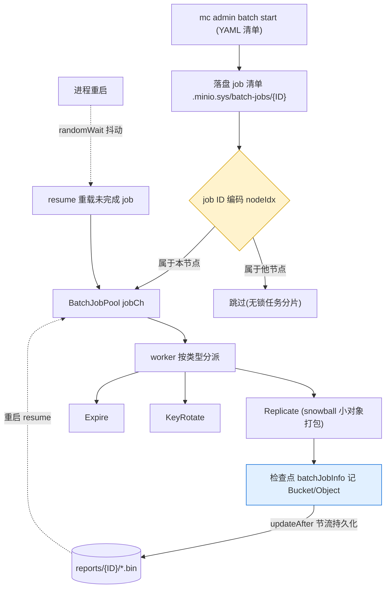
```mermaid
flowchart TD
    Submit["mc admin batch start (YAML 清单)"] --> Save["落盘 job 清单 .minio.sys/batch-jobs/{ID}"]
    Save --> Node{"job ID 编码 nodeIdx"}
    Node -->|属于本节点| Pool["BatchJobPool jobCh"]
    Node -->|属于他节点| Skip2["跳过(无锁任务分片)"]
    Pool --> Worker["worker 按类型分派"]
    Worker --> Rep["Replicate (snowball 小对象打包)"]
    Worker --> Exp["Expire"]
    Worker --> Rot["KeyRotate"]
    Rep --> CK["检查点 batchJobInfo 记 Bucket/Object"]
    CK -->|"updateAfter 节流持久化"| CKDisk[("reports/{ID}/*.bin")]
    CKDisk -.重启 resume.-> Pool
    Restart["进程重启"] -.randomWait 抖动.-> Resume["resume 重载未完成 job"]
    Resume --> Pool
    style Node fill:#fff3cd,stroke:#d39e00
    style CK fill:#e1f0ff,stroke:#0366d6
```

## 21. Site Replication：对等广播 + 两阶段 heal

> 对应 [深读 15](deep/15-site-replication-deep.md)。注意与图 31（集群内）的对比。

```mermaid
flowchart TD
    Change["本站点改 IAM/bucket 配置"] --> Local["先应用到本地"]
    Local --> Hook["XxxHook → concDo 并行广播"]
    Hook --> P1["peer 站点 B"]
    Hook --> P2["peer 站点 C"]
    P1 --> LWW{"updatedAt 时间戳比较"}
    P2 --> LWW
    LWW -->|本地更新| Ignore["忽略(防旧覆盖新)"]
    LWW -->|对方更新| Apply["应用变更"]
    Hook -.peer 不通.-> Offline["标记 offline"]
    Heal["startHealRoutine 单 leader 30s"] --> H1["① healIAMSystem 先修身份"]
    H1 --> H2["② healBuckets 再修数据"]
    Offline -.下轮 heal 补齐.-> Heal
    style LWW fill:#fff3cd,stroke:#d39e00
    style H1 fill:#e1f0ff,stroke:#0366d6
```

## 22. Metrics：分组 TTL 缓存 + 依赖门控

> 对应 [深读 16](deep/16-metrics-v2-deep.md)。

```mermaid
flowchart TD
    Scrape["Prometheus scrape"] --> Coll["minioCollector.Collect"]
    Coll --> Group["各 MetricsGroup.Get()"]
    Group --> Cache{"cachevalue TTL 内?"}
    Cache -->|是 atomic 无锁| Hit["直接返回缓存(零计算)"]
    Cache -->|过期| Lock["updating 锁(单飞)"]
    Lock --> Dep{"依赖门控"}
    Dep -->|"子系统未就绪/未启用"| Empty["返回空(不崩不报错)"]
    Dep -->|就绪| Read["read() 真采集(贵)"]
    Read -->|失败| Last["ReturnLastGood 兜底"]
    Read -->|成功| Store["atomic 存 + 时间戳"]
    Hit --> Out["MustNewConstMetric"]
    Store --> Out
    Last --> Out
    style Cache fill:#fff3cd,stroke:#d39e00
    style Hit fill:#d4edda,stroke:#28a745
```

## 23. 退役/重平衡：搬运 = 逐对象重写

> 对应 [深读 17](deep/17-decom-rebalance-deep.md)。

```mermaid
flowchart LR
    Trig{"触发"}
    Trig -->|管理员 decommission| DStart["标 Suspended"]
    Trig -->|加新池失衡| RStart["低空闲率池 Participating"]
    DStart --> List["listObjectsToDecommission 逐对象"]
    RStart --> List
    List --> Ver["按版本升序遍历(全版本保留)"]
    Ver --> RW["读出来 → PutObject 重写"]
    RW -->|"DataMovement + SrcPoolIdx"| Exclude["排除源池 → 落到别的池"]
    RW -.保留.-> Pres["ETag/VID/MTime/压缩 Index"]
    Exclude --> Decom{"模式"}
    Decom -->|decom| Empty2["清空后移除池"]
    Decom -->|rebalance| Del["删源副本释放空间"]
    List -.进度.-> Ckpt[("poolMeta / rebalance.bin 断点续传")]
    style RW fill:#e1f0ff,stroke:#0366d6
    style Exclude fill:#fff3cd,stroke:#d39e00
```

## 24. S3 Select SQL 引擎：解析 → AST → 树遍历

> 对应 [深读 21](deep/21-s3select-sql-engine-deep.md)。

```mermaid
flowchart TD
    SQL["SQL 文本"] --> Parse["participle 文法(tag 即产生式)"]
    Parse --> AST["强类型 AST<br/>优先级=嵌套深度"]
    AST --> Eval["逐记录 evalNode 树遍历"]
    Eval --> OR["Expression OR 短路"]
    OR --> AND["AndCondition AND 短路"]
    AND --> Cond["比较/BETWEEN/LIKE/IN"]
    Cond --> JP["JSONPath 取值"]
    JP -->|JSON| Down["沿路径下钻 jsonpathEval"]
    JP -->|CSV| Col["按列取 r.Get"]
    Col --> Infer["BYTES 延迟类型推断<br/>int 优先→float→报错"]
    Cond --> Func{"函数"}
    Func -->|标量| Scalar["逐行无状态变换"]
    Func -->|聚合| Agg["有状态累加(EOF 出结果)"]
    style Infer fill:#fff3cd,stroke:#d39e00
    style Agg fill:#e1f0ff,stroke:#0366d6
```

## 25. 多段上传：三段式

> 对应 [深读 22](deep/22-multipart-upload-deep.md)。

```mermaid
sequenceDiagram
    participant C as 客户端
    participant S as MinIO
    participant M as .minio.sys/multipart
    C->>S: NewMultipartUpload
    S->>M: 建 uploadID 目录(sha256(对象名)/uuid)
    S-->>C: uploadID
    par 并行上传各 part
        C->>S: PutObjectPart 1 (≥5MB)
        S->>M: 独立纠删码写 part.1
        C->>S: PutObjectPart 2
        S->>M: 独立纠删码写 part.2
    end
    C->>S: CompleteMultipartUpload (part ETag 列表)
    Note over S: 校验每 part ETag(加密需解密调整)<br/>校验最小 part 大小<br/>CRC-of-CRCs 合并
    S->>S: renameData 从 multipart 搬到正式位置
    S-->>C: 200 + ETag(md5-N)
```

## 26. 对象列举与 metacache

> 对应 [深读 23](deep/23-listing-metacache-deep.md)。

```mermaid
flowchart TD
    List["ListObjects (prefix/marker/delimiter)"] --> Has{"marker 含缓存 ID?"}
    Has -->|否 冷列举| Scan["listPathRaw 跨盘 WalkDir"]
    Scan --> Merge["多路归并 + agreed/partial quorum"]
    Merge --> SaveC["saveMetaCacheStream 分块存盘"]
    SaveC --> Page1["返回首页 + 缓存 ID"]
    Has -->|是 续页| Owner["restClientFromHash 定位缓存所有者节点"]
    Owner --> Stream["streamMetadataParts 从缓存流式读这一页"]
    Stream --> Forward["ForwardTo 快进到 marker"]
    Scan -.askDisks 子集.-> FB["失败用 fallback 盘"]
    style SaveC fill:#fff3cd,stroke:#d39e00
    style Owner fill:#e1f0ff,stroke:#0366d6
```

## 27. bucket 元数据存储与传播

> 对应 [深读 24](deep/24-bucket-metadata-deep.md)。

```mermaid
flowchart TD
    Set["mc 改某项 bucket 配置"] --> Update["updateAndParse"]
    Update --> Field["只改该字段 + 其 UpdatedAt"]
    Field --> Enc{"含凭证?"}
    Enc -->|bucketTargets| KMS["KMS 加密"]
    Enc -->|其它| Plain["明文"]
    KMS --> Save["写 .metadata.bin(一个文件装全部配置)"]
    Plain --> Save
    Save --> CacheUp["Set 内存缓存"]
    CacheUp --> Bcast["LoadBucketMetadata 广播 peer 重读"]
    AllCfg["policy/versioning/lock/SSE/ILM/复制/通知/标签/配额/目标"] -.合并进.-> Save
    style Save fill:#fff3cd,stroke:#d39e00
    style Bcast fill:#e1f0ff,stroke:#0366d6
```

## 28. STS AssumeRole 统一流程

> 对应 [深读 25](deep/25-sts-identity-deep.md)。

```mermaid
flowchart TD
    R{"AssumeRole 变体"}
    R -->|内部用户| V1["验用户名/密钥"]
    R -->|WebIdentity/SSO| V2["验外部 IdP 签名(OpenID)"]
    R -->|LDAP| V3["LDAP bind + 查组"]
    R -->|证书| V4["验客户端证书"]
    R -->|自定义| V5["AuthN 插件"]
    V1 --> Claims["建 claims:parent + exp + 会话策略"]
    V2 --> Claims
    V3 --> Claims
    V4 --> Claims
    V5 --> Claims
    Claims --> JWT["签名 → SessionToken=自包含 JWT"]
    JWT --> Temp["临时凭证(继承父策略 ∩ 会话策略)"]
    Temp --> Store["SetTempUser 入 IAM"]
    Store --> SR["site-repl hook 传播 peer 站点"]
    style JWT fill:#fff3cd,stroke:#d39e00
    style Temp fill:#e1f0ff,stroke:#0366d6
```

## 29. 配置子系统：ENV 覆盖 + 加密 + 历史

> 对应 [深读 26](deep/26-config-subsystem-deep.md)。

```mermaid
flowchart TD
    Load["initConfig"] --> Read["读 config.json (.minio.sys/config, MaxParity)"]
    Read --> Dec{"配了 KMS?"}
    Dec -->|是| Decrypt["解密"]
    Dec -->|否| Raw["明文"]
    Decrypt --> Merge["srvCfg.Merge 填默认"]
    Raw --> Merge
    Merge --> Env["lookupConfigs: ENV 覆盖"]
    Env --> Prio["优先级: ENV > config.json > 默认"]
    Prio --> Global["globalServerConfig (原子替换)"]
    SetCfg["mc admin config set"] --> SaveCfg["KMS 加密落盘 + 存历史版本"]
    SaveCfg -.peer 广播热加载.-> Load
    SaveCfg --> Hist[("config-history/<uuid> 可 restore")]
    style Env fill:#fff3cd,stroke:#d39e00
    style Prio fill:#e1f0ff,stroke:#0366d6
```

## 30. 对象锁 WORM 删除判定

> 对应 [深读 27](deep/27-versioning-objectlock-deep.md)。

```mermaid
flowchart TD
    Del["删除/覆盖请求"] --> LH{"Legal Hold ON?"}
    LH -->|是| Lock1["拒绝(无期限,显式关才解)"]
    LH -->|否| Ret{"Retention 模式"}
    Ret -->|无| Allow["允许"]
    Ret -->|COMPLIANCE| Comp{"RetainUntil 过期?"}
    Comp -->|否| Lock2["拒绝(连 root 都拦)"]
    Comp -->|是| Allow
    Ret -->|GOVERNANCE| Gov{"带 bypass 头 + 有权限?"}
    Gov -->|否 且未过期| Lock3["拒绝"]
    Gov -->|是| Allow
    Time["RetainUntil 比较用 NTP 时间<br/>(防改本地时钟绕过)"] -.-> Comp
    Time -.-> Gov
    style Lock2 fill:#ffe0e0,stroke:#d33
    style Time fill:#fff3cd,stroke:#d39e00
```

## 31. 集群内协调 vs 跨集群复制

> 对应 [深读 28](deep/28-peer-coordination-deep.md)。一张图讲清两者本质区别。

```mermaid
flowchart TB
    subgraph Intra["集群内 (NotificationSys / peer)"]
        direction LR
        D1["改 IAM/配置"] --> W1["落盘(数据仅一份,共享后端)"]
        W1 --> B1["广播 peer: 重读缓存"]
        B1 --> R1["各节点从共享盘重读(数据本就一致)"]
    end
    subgraph Inter["跨集群 (Site Replication)"]
        direction LR
        D2["改 IAM/配置"] --> W2["本地应用(各集群独立后端)"]
        W2 --> B2["concDo 复制数据到 peer 站点"]
        B2 --> R2["LWW 时间戳冲突解决(数据多份)"]
    end
    Note["集群内=通知重读(缓存失效)<br/>跨集群=复制数据(+LWW)"]
    Intra -.-> Note
    Inter -.-> Note
    style Intra fill:#e1ffe1,stroke:#28a745
    style Inter fill:#fff3cd,stroke:#d39e00
```

## 32. Admin Heal：异步可轮询

> 对应 [深读 29](deep/29-admin-api-heal-ops-deep.md)。

```mermaid
sequenceDiagram
    participant C as mc admin heal
    participant A as allHealState
    participant H as healSequence(后台)
    participant E as 自愈引擎(深读13)
    C->>A: 启动 heal(bucket/prefix)
    A->>H: newHealSequence + 后台 traverseAndHeal
    A-->>C: clientToken (立即返回)
    H->>E: 逐对象 queueHealTask
    E->>E: shouldHealOnDisk + Erasure.Heal 重建
    loop 客户端周期轮询
        C->>A: PopHealStatusJSON(token)
        A-->>C: 增量进度(scanned/healed/failed)
    end
    Note over C,H: 断连可用同 token 续查,heal 在服务端后台不停
```

---

## 怎么用这张图集

1. **先看图 1（分层）+ 图 19（模块地图）** 建立全局骨架。
2. **追一个请求**：图 4（PUT）/ 图 5（GET）→ 想看细节就跳到图 6/7（内核）。
3. **专题深入**：图 1–19 是核心路径，图 20–32 是外围与运维子系统；每张图下方的"对应深读篇"链接图文对照。
4. **两组对照看更通透**：图 31（集群内 vs 跨集群）配 图 21（site-repl）；图 23（搬运=重写）回看 图 4（PUT）；
   图 25/26（多段/列举）补全 图 4/5（PUT/GET）没展开的两条特殊路径。
5. **复用模式识别**：注意多张图里反复出现的 **接口抽象**（ObjectLayer/StorageAPI/WarmBackend/Target/
   recordReader/IdP）、**任务队列+磁盘溢出**（MRF/QueueStore/batch 检查点/heal 序列）、**单 leader 后台任务**、
   **背压丢弃+计数**、**盘→缓存→peer 广播**、**自举存储**——这就是 MinIO 的"设计语言"。

> 完整文字精读见 [`deep/00-index.md`](deep/00-index.md)（29 篇）和 [概览索引](00-index.md)（7 篇）。
