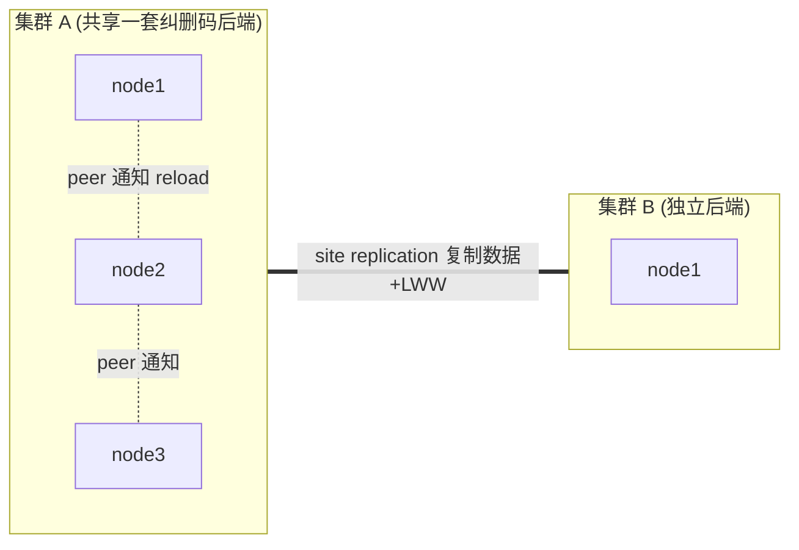

# 深读 28 · 集群内节点协调（peer 通知）逐层精读

> 前面多篇都提到"改完 → 通知所有 peer 重载"。本篇拆开这个**集群内协调层**：`NotificationSys` +
> `peerRESTClient` 如何广播缓存失效、admin/可观测性如何 fan-out 聚合,以及它与 site replication
> (跨集群)的**本质区别**(`cmd/notification.go` + `peer-rest-client.go`)。

---

## 1. 两层协调:集群内 vs 跨集群


`★ 这是理解 MinIO 一致性的关键分界 ─────────────────`
- **集群内(NotificationSys / peer)**:一个集群的所有节点**共享同一套纠删码后端**(同一批 erasure
  set、同一份数据)。IAM/bucket 配置等只有**一份**,存在共享的 erasure set 上。所以集群内协调
  **不是复制数据,而是让各节点的内存缓存失效重读**——数据本就一致,只需同步"缓存"。
- **跨集群(site replication,深读 15)**:不同集群**各有独立后端**。改一处要**真正把数据复制**过去,
  且并发改要 LWW 冲突解决。
- **一句话区别**:集群内"通知重读"(数据一份、缓存多份);跨集群"复制数据"(数据多份)。理解这点,
  就不会把两者搞混——为什么 IAM 改了集群内瞬间一致(只是 reload),而跨站点要等复制 + 可能 LWW。
`──────────────────────────────────────────`

---

## 2. `NotificationSys`:向所有 peer 广播

```go
// notification.go:50
type NotificationSys struct {
    peerClients    []*peerRESTClient   // 所有其它节点(不含自己)
    allPeerClients []*peerRESTClient   // 含自己(自己位置是 nil)
}
// LoadBucketMetadata:并行广播"重载某 bucket 元数据"
func (sys *NotificationSys) LoadBucketMetadata(ctx, bucketName) {
    ng := WithNPeers(len(sys.peerClients))
    for idx, client := range sys.peerClients {
        ng.Go(ctx, func() error { return client.LoadBucketMetadata(ctx, bucketName) }, idx, *client.host)
    }
    for _, nErr := range ng.Wait() {
        if nErr.Err != nil { peersLogOnceIf(...) }   // ★ 错误只 log,不阻断
    }
}
```
`★ 广播模式的两个讲究 ─────────────────────────`
- **并行 fan-out**(`WithNPeers` + `ng.Go`):同时通知所有节点,不串行等。收到通知的节点各自从
  共享后端**重读那一项**到本地缓存。
- **best-effort,不因单节点失败而阻断**:某个 peer 下线/超时,错误只 `peersLogOnceIf` 记日志,
  **不让整个配置变更失败**。因为数据已经落盘了(权威),通知只是加速缓存一致——某节点没收到,它
  下次自然会从盘读到新值,或被 IAM/元数据的定期 reload 兜底。**通知是优化,不是正确性依赖**。
- `LoadPolicy`/`LoadUser`/`DeletePolicy`/`LoadPolicyMapping`... 一整套对应 IAM/元数据/配置的各类
  变更,每个都是"广播让 peer 重读某项"。
`──────────────────────────────────────────`

这统一了前面多篇的"盘→缓存→peer 广播"模式:
- IAM(深读 09):改用户/策略 → 落盘 → `LoadPolicy`/`LoadUser` 广播
- bucket 元数据(深读 24):改配置 → 落盘 → `LoadBucketMetadata` 广播
- 配置(深读 26):改 config → 落盘 → 广播重载

**它们都靠 NotificationSys 这一个广播机制保持集群内缓存一致。**

---

## 3. `peerRESTClient`:节点间管理通道

```go
// peer-rest-client.go:43  到每个 peer 节点的 REST(走 grid)客户端
// 不只用于 reload 广播,还承载大量 admin/可观测性调用:
GetLocks / LocalStorageInfo / ServerInfo / GetCPUs / GetNetInfo / GetOSInfo /
GetMemInfo / GetMetrics / GetProcInfo / GetMetacacheListing / ...
```
`★ peer 客户端 = 集群的"管理总线"───────────────`
- `peerRESTClient` 是到每个 peer 的双向通道(REST over grid,深读 06)。除了 reload 广播,它还是
  **admin 命令和可观测性的 fan-out 通道**:
  - `mc admin info` → 向所有 peer `ServerInfo` → 聚合成集群视图。
  - `mc admin top locks` → 向所有 peer `GetLocks` → 汇总当前锁。
  - 指标(深读 16)、healing 状态、CPU/内存/磁盘信息 → 都靠它从各节点收集。
- **`restClientFromHash`**:按资源哈希选出"拥有者节点"(深读 23 metacache 的所有者路由就用它)。
  某些资源(列举缓存)归属单个节点,通过哈希定位。
- `allPeerClients` 里**自己的位置是 nil**:发给自己的调用本地直接处理,不发 RPC 给自己(深读 06
  grid 也是本机不连自己)。
`──────────────────────────────────────────`

---

## 4. 与 grid 的关系

- `peerRESTClient` 底层走 **grid**(深读 06)——和 `storageRESTClient`(远端盘)共用同一套节点间
  多路复用连接。
- 区别:`storageRESTClient` 是**盘级**调用(读写某块远端盘);`peerRESTClient` 是**节点级**调用
  (问某个节点的全局状态、让它 reload 缓存)。两者都通过 grid 的一条 WebSocket 复用。
- 所以一个 MinIO 节点对另一个节点的全部通信(盘 I/O + 管理 + reload)**都收敛到那一条 grid 连接**
  ——深读 06 说的"一对节点一条连接"在这里得到完整印证。

---

## 5. 一页纸总结集群内协调的"硬核点"

| # | 细节 | 为什么重要 |
|---|------|-----------|
| 1 | 集群内"通知重读" vs 跨集群"复制数据" | 数据一份缓存多份 vs 数据多份 |
| 2 | 集群内数据本就一致(共享后端) | 协调只需缓存失效,非数据同步 |
| 3 | NotificationSys 并行 fan-out 广播 | 同时通知所有节点重读 |
| 4 | best-effort,单节点失败只 log 不阻断 | 通知是优化非正确性依赖,盘是权威 |
| 5 | 统一 IAM/元数据/配置的"盘→缓存→广播" | 一个机制保持集群缓存一致 |
| 6 | peerRESTClient 也是 admin/可观测 fan-out 通道 | mc admin info/locks/metrics 聚合 |
| 7 | restClientFromHash 路由资源拥有者 | metacache 等归属单节点 |
| 8 | allPeerClients 自己位置为 nil | 本机调用不发 RPC 给自己 |
| 9 | 底层走 grid,与盘 I/O 共用连接 | "一对节点一条连接"完整印证 |

下一篇深读(系列四度收官):**Admin API 与运维**——admin handlers、heal 运维 ops、服务管理、
profiling、与可观测性的关系。
